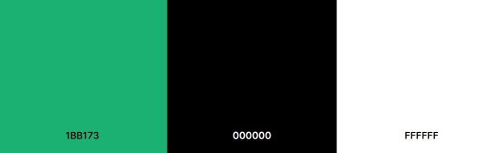
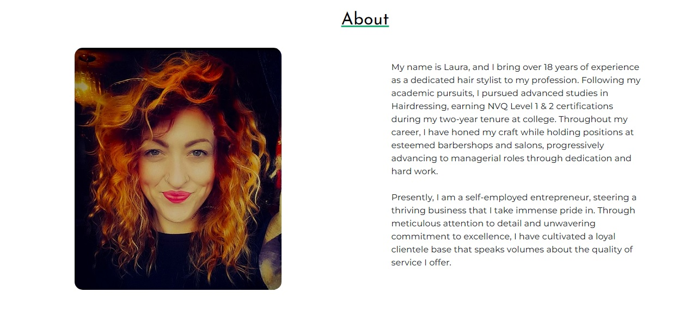
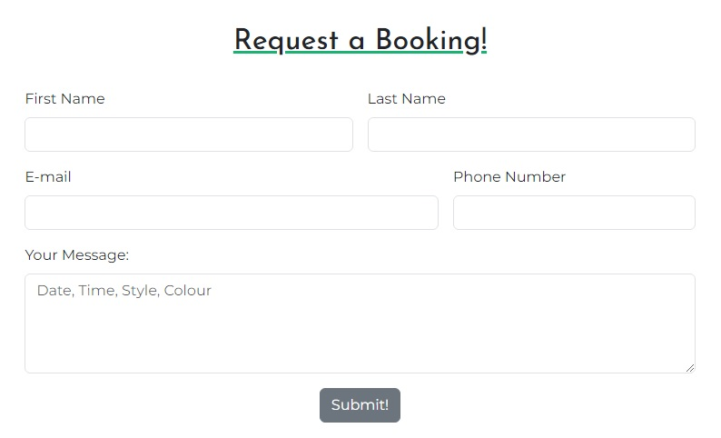

# Meraki Hairdressing

Welcome to Meraki Hairdressing! Dedicated to providing exceptional hair care services tailored to suit your unique style and preferences. Whether you're looking for a stylish haircut, a vibrant color transformation or a fabulous new hairstyle, you're in great hands with a highly experienced professional who is here to make your hair dreams a reality.

This website is for my partner Laura to show off her talent and skillset with a gallery of her work, a comprehensive price list and a little bit about her so you get a feel for her personality. Also a page to request a booking if you like what you see.

Link to the website can be found [Here](https://frankrankmore.github.io/Meraki/)

## UX

### Site Purpose

The purpose of this website is to promote the business to a wider audience and for the customer to feel confident in choosing a hairstylist who can create a new look and also find inspiration through browsing the gallery.

### Goals

#### New Customers

* A website that looks intriguing and easy to navigate.
* To gain insights into the stylist's personality traits and professional background.
* To draw inspiration when choosing your next hairstyle or appearance transformation..
* Contact page for bookings or any questions they might have.

#### Existing Customers

* Updates for any changes to the business.
* Gallery updates serve as a platform for customers to browse and explore the latest artistic creations.
* Adjustments to pricing in response to economic conditions and market dynamics to ensure fair and competitive rates.

# Design:

### Colour Scheme

The colour scheme is based on the clients favourite colour of green. On a black background it brings out the green which really catches the eye.

### Typography

Josefin Sans was chosen for the navbar and headers, as its sleek design harmonizes with the overall style. Meanwhile, Montserrat was specifically selected for paragraphs and price lists due to its clear presentation, ensuring optimal readability for users navigating through the content.

### Wireframes

The wireframes were designed as a guide on how I want my website to look. There were some changes made in the final outcome of website.

#### Mobile Wireframe

#### Tablet Wireframe

#### Desktop Wireframe

## Features:

### Navbar

The navbar is intentionally designed to be both visually appealing and functional. It runs with the colour scheme of the website, in the overall design. One notable feature of the navbar is its hover effect, which enhances user interaction. When a user hovers over a navigation link, it dynamically changes color to white, providing visual feedback and highlighting the selected option. 

### Footer

By opting for a minimalist approach in designing the footer, I intentionally refrained from cluttering it with unnecessary elements. Instead, I focused solely on including links to the brand's social media pages.

### About

This section gives an insight into the clients background, achievements and experiences. 

### Price List

A comprehensive price list for the user to view.

### Gallery

A Gallery to see the clients work and gain some inspiration.

### Contact

Contact page for the user to request a booking or ask any questions.

### Thank You

Below is a thank you page which is for the users confirmation after a booking has been requested successfully.

## Testing:

During testing I found that my images weren't responding on my deployed website. I found that I had a (/) before the assets image link. This was removed and images were loading correctly.

Also my hero image wasn't responsive, so i got around this by adding the following media query.

### Validator Testing

Home page test 

